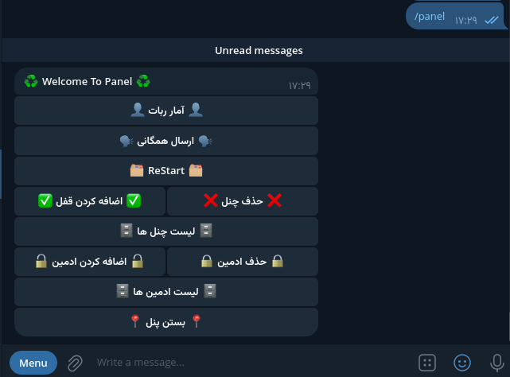

# 📤 Telegram Uploader Bot

This Telegram bot allows you to upload your media files and receive a dedicated link for them. Anyone who accesses the bot through this link can access the media file.

## 🚀 Features

- Easy Upload: Simply upload your media files.
- Unique Link: Receive a unique link for each file.
- Easy Access: Anyone with the link can download the file.

### Admin Panel

- Bot Status
- Send To All Members
- Restart Bot
- Add New Channel
- Remove Channel
- Show Channels List
- Add New Admin
- Remove Admin
- Show Admins List
---

## 🛠 How to Use

1. Set up the bot in Telegram.
2. Add the necessary information in the config.
3. Run the bot.

## 🎉 Conclusion

With this bot, you can easily share your media files and enjoy its features! 📲✨

—

> Note: Use of this bot must comply with Telegram's terms and conditions and intellectual property rights.